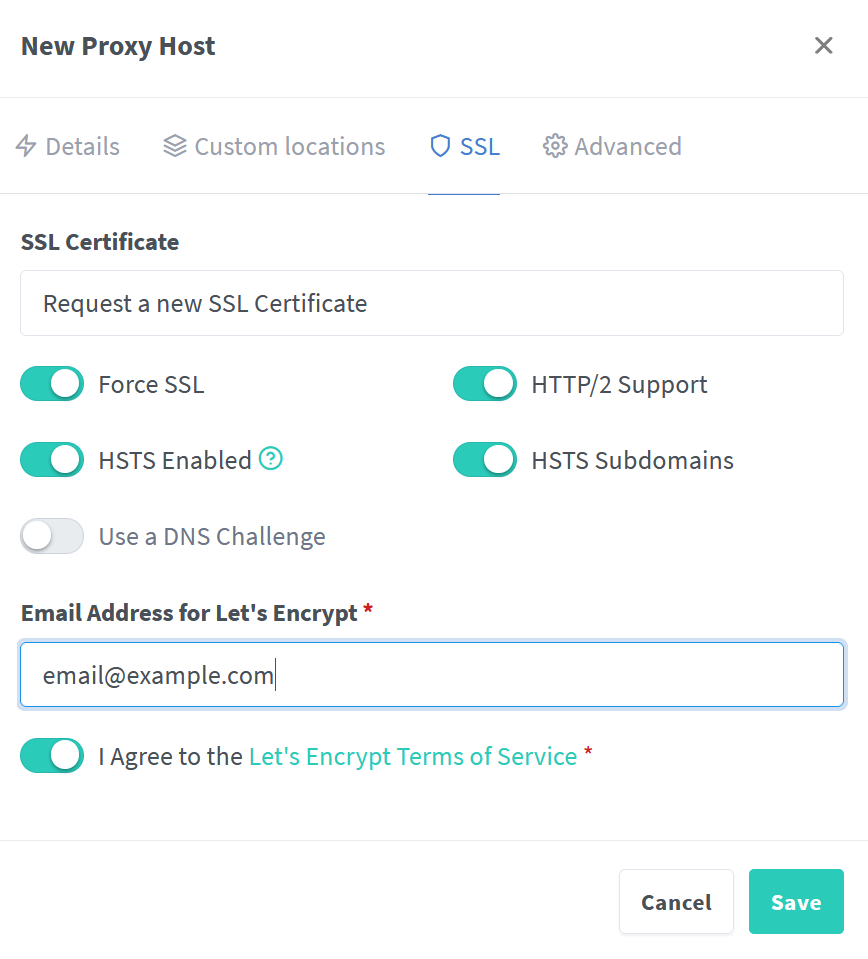

- requires docker, docker compose
- assumes want to deploy on nginx proxy manager on *nginx_default* network

Create a separate directory

```bash
mkdir escape-game
```

## Deploying on Docker

First we need to build docker image

```bash
docker build -t nextjs-escapev1 https://github.com/Doozy134/escape.git
```
```bash
echo "OLLAMA_API_HOST=ollama" >> .env
```

### Nvidia GPU - runs better

```bash
docker compose -f docker-compose-gpu.yml up -d
```

### Without GPU

```bash
docker compose -f docker-compose.yml up -d
```

#### Add to nginx proxy manager
Add a new proxy host 
 

request an SSL
 

## Running locally
assumes ollama is installed and running in a separate terminal

```bash 
ollama run mistral
```

Then can run nextjs using:

```bash
npm run dev
# or
yarn dev
# or
pnpm dev
# or
bun dev
```

Open [http://localhost:3000](http://localhost:3000) with your browser 
