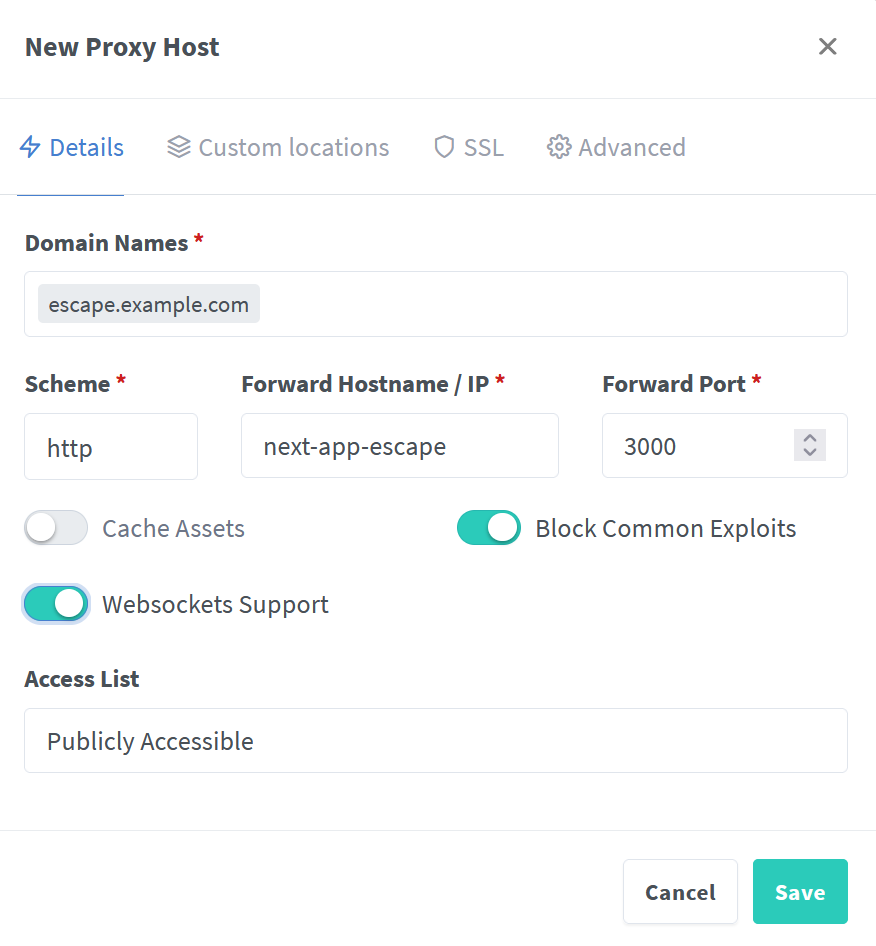

# Escape


#### Create a separate directory

```bash
mkdir escape-game
```

There are 2 different ways to deploy:

1. [Docker](#deploying-on-docker)
2. [Local](#running-locally)

## Deploying on Docker

> **Prerequisites:**
> docker, docker compose

> **NOTE**
> Assumes deploying with ['nginx proxy manager'](https://nginxproxymanager.com/), on the `nginx-default` network

First, we need to build the docker image

```bash
docker build -t escape:0.1 https://github.com/Doozy134/escape.git
```
```bash
echo "OLLAMA_API_HOST=ollama" >> .env
```

### Nvidia GPU 

##### *Improves the performance of ollama*

```bash
curl https://raw.githubusercontent.com/Doozy134/escape/main/docker-compose-gpu.yml > docker-compose.yml
docker compose up -d
```

### Without GPU

```bash
curl https://raw.githubusercontent.com/Doozy134/escape/main/docker-compose.yml > docker-compose.yml
docker compose up -d
```

### Install Mistral

You need to now install Mistral within the Ollama Container.

```bash
docker exec -it ollama sh
# once inside the container pull the manifest
ollama pull mistral 
```

### Add to Nginx Proxy Manager
- Add a new proxy host 
<div>
 
</div>

- Request an SSL
<div>
 
</div>


## Running Locally

You need to [install](https://ollama.com/download) ollama, for example on linux:
```bash
curl -fsSL https://ollama.com/install.sh | sh
```
Now we need to download the correct model
```bash 
ollama pull mistral
```
In a separate terminal, run `ollama run mistral`

Then in a different terminal we can use node to run the frontend:

```bash
npm run dev
# or
yarn dev
# or
pnpm dev
# or
bun dev
```

Open [http://localhost:3000](http://localhost:3000) with your browser 
